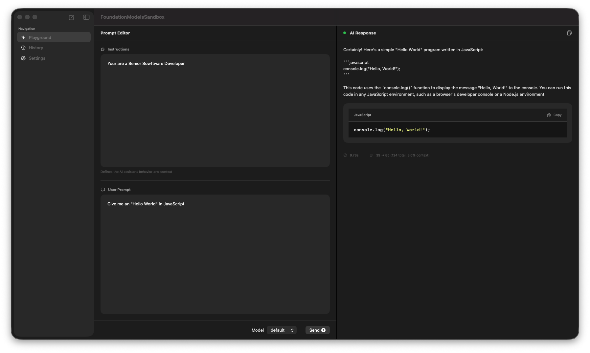

# 🤖 FoundationModelsSandbox



## 📝 Description

macOS application for exploring and learning **Apple's Foundation Models framework** (`FoundationModels`). This project serves as a sandbox to understand and experiment with Apple's native AI/ML capabilities, particularly the `SystemLanguageModel` and on-device AI processing.

The app provides a clean interface to send prompts to Apple's Intelligence models and receive responses, serving as a practical learning tool for understanding how to integrate Foundation Models into your own applications.

> Project used for learn **Apple Foundation Models framework** + **Clean Architecture** + **SwiftUI**

## 📋 Requirements

- **macOS 26.4+** (for latest Foundation Models support)
- **Xcode 26.4+**
- **Swift 6.0+**

## 🚩 Instructions

   ```bash
   # Clone the repository
   git clone <repository-url>
   
   # Open in Xcode
   open FoundationModelsSandbox.xcodeproj
   
   # Or build from command line
   xcodebuild -project FoundationModelsSandbox.xcodeproj \
     -scheme FoundationModelsSandbox \
     -destination 'platform=macOS' \
     build
   ```

   - Select a scheme in Xcode (FoundationModelsSandbox)
   - Choose "My Mac" as the destination
   - Press ⌘+R to run

## 🚧 Application Architecture

[Swift](https://www.apple.com/es/swift/) + [SwiftUI](https://developer.apple.com/xcode/swiftui/) macOS application.

### Clean Architecture Layers

```
FoundationModelsSandbox/
├── Business/                 # Business logic layer
│   ├── FoundationModelsInteractor.swift    # Coordinates AI model interactions
│   └── AppleIntelligenceNotAvailableError.swift
│
├── Components/               # Reusable UI components
│   ├── SidebarView.swift
│   ├── PromptPanelView.swift
│   ├── AIResponseView.swift
│   └── ...
│
├── Scenes/                  # Feature modules
│   └── Main/
│       ├── MainView.swift        # Main app view
│       └── MainViewModel.swift   # @Observable ViewModel
│
├── Common/                   # Shared utilities
│   └── Styles/
│       └── Theme.swift      # Design system + Liquid Glass
│
└── FoundationModelsSandboxApp.swift  # App entrypoint
```

### Key Technologies

- **Swift 6** with Strict Concurrency (`SWIFT_STRICT_CONCURRENCY = complete`)
- **@Observable** ViewModels for state management
- **async/await** for all asynchronous operations
- **Dependency Injection** via protocol initializers
- **Apple Liquid Glass** (`glassEffect()`) for native UI
- **NavigationSplitView** for three-column layout

### Design Patterns

- **Clean Architecture** - Separation of concerns (UI / Business / Data)
- **MVVM** - Model-View-ViewModel with @Observable
- **Repository Pattern** - Via FoundationModelsInteractor protocol

### Technical Implementation

#### Swift 6 Strict Concurrency
The project enforces strict concurrency checking:

- All types must be `Sendable` unless explicitly marked
- `@MainActor` for UI-bound state
- `actor` isolation for shared mutable state
- No completion handlers - `async/await` only

## ✅ App Features

### Foundation Models Integration

The app demonstrates real Foundation Models usage:

```swift
// Example: Using SystemLanguageModel
let model = SystemLanguageModel.default
let session = LanguageModelSession(model: model)
let response = try await session.respond(to: prompt)
```

### Prompt Editor

- **Instructions Field**: Define AI assistant behavior and context
- **User Prompt Field**: Enter your questions or requests
- **Model Selection**: Choose between available models (GPT-4, Claude, etc.)
- **Send Action**: Submit prompts to Apple Intelligence

### AI Response Display

- **Natural Language Responses**: View AI-generated text
- **Code Block Detection**: Automatic extraction and syntax highlighting
- **Error Handling**: Graceful display of model availability issues

### Navigation

- **Sidebar**: Quick access to Playground, History, and Settings
- **Three-Column Layout**: Native macOS NavigationSplitView

## 🔮 Learning Objectives

This sandbox demonstrates:

1. ✅ **Foundation Models Framework** - Using `SystemLanguageModel` and `LanguageModelSession`
2. ✅ **Clean Architecture** - Proper layer separation in SwiftUI
3. ✅ **Swift Concurrency** - async/await, @Observable, @MainActor
4. ✅ **Apple Design Languages** - Liquid Glass, native components
5. ✅ **Dependency Injection** - Protocol-based testability

## 💻 Author

> **Javier Laguna**